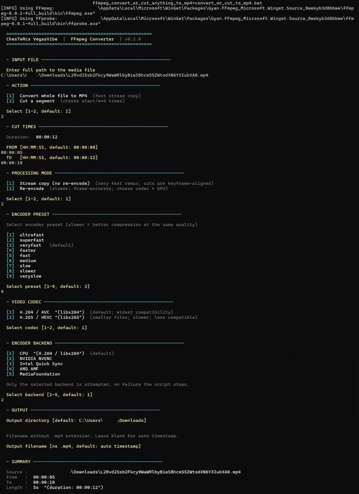

# ChesTeRcs VegasVibe — FFmpeg Toolkit

**Free, open-source Windows CLI toolkit for converting, cutting, and remixing video — powered by FFmpeg.**

No subscriptions. No watermarks. No GUI overhead. Just double-click and go.

> Built with the help of AI (Claude).

---

## What it does

Three interactive wizard scripts — answer a few prompts and you're done:

| Script | What it does |
|---|---|
| `convert_or_cut_to_mp4.bat` | Convert any video/audio to MP4, or cut a precise time segment out of it |
| `add_audio_to_mp4.bat` | Replace a video's audio track with a music file of your choice |

**Output is always MP4** — the most compatible format for sharing, editing, and playback everywhere.

---

## Features

### Convert or Cut (`convert_or_cut_to_mp4.bat`)
- **Convert any file to MP4** — MKV, AVI, MOV, TS, M2TS, WebM, and anything else FFmpeg can read
- **Cut a segment** — specify start and end time (`HH:MM:SS`), get a clean MP4 clip
- **Stream copy (default)** — ultra fast remux with zero quality loss
- **Re-encode** — frame-accurate cuts with H.264 or H.265, full preset control

### Replace Audio (`add_audio_to_mp4.bat`)
- Drop any music file onto a video — MP3, FLAC, WAV, AAC, anything
- **Start the music at any offset** — pick where in the track it begins
- Output length always matches the video
- Stream copy or full re-encode mode

### Encoding options (both scripts)
- **H.264** (libx264) — widest compatibility
- **H.265 / HEVC** (libx265) — smaller files, same quality
- **GPU acceleration**: NVIDIA NVENC, Intel Quick Sync, AMD AMF, MediaFoundation
- **9 encoder presets**: ultrafast → veryslow
- **Automatic FFmpeg install** via `winget` if not already present

---

## Requirements

- **Windows 10 or 11**
- **FFmpeg** — auto-installed on first run if missing (`winget install Gyan.FFmpeg`)
- GPU backends are optional — CPU always works

---

## Installation

1. Download or clone this repository
2. Double-click any `.bat` script to run it
3. If FFmpeg is missing, the script will offer to install it automatically

That's it — no installer, no dependencies, no admin rights needed for normal use.

---

## Usage

Every script is a step-by-step wizard. Just run it and follow the prompts.

Colored menus, clear prompts, sensible defaults. Press Enter to accept defaults throughout.

---

## Free & Open Source

- **Free** — no cost, no trial, no limits
- **Open source** — MIT License, do whatever you want with it
- **No telemetry** — runs entirely on your machine, no internet required (except FFmpeg install)

---

## License

MIT License — see [LICENSE](LICENSE) or the bottom of this file.

Permission is hereby granted, free of charge, to any person obtaining a copy of this software to use, copy, modify, merge, publish, distribute, sublicense, and/or sell copies, subject to the above copyright notice appearing in all copies.

THE SOFTWARE IS PROVIDED "AS IS", WITHOUT WARRANTY OF ANY KIND.
